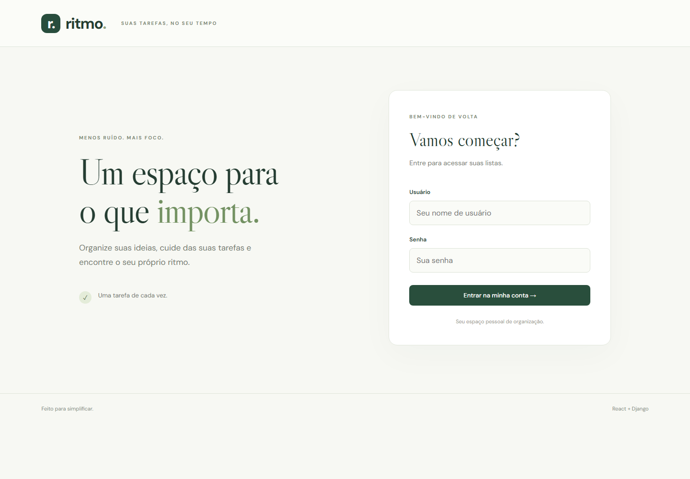
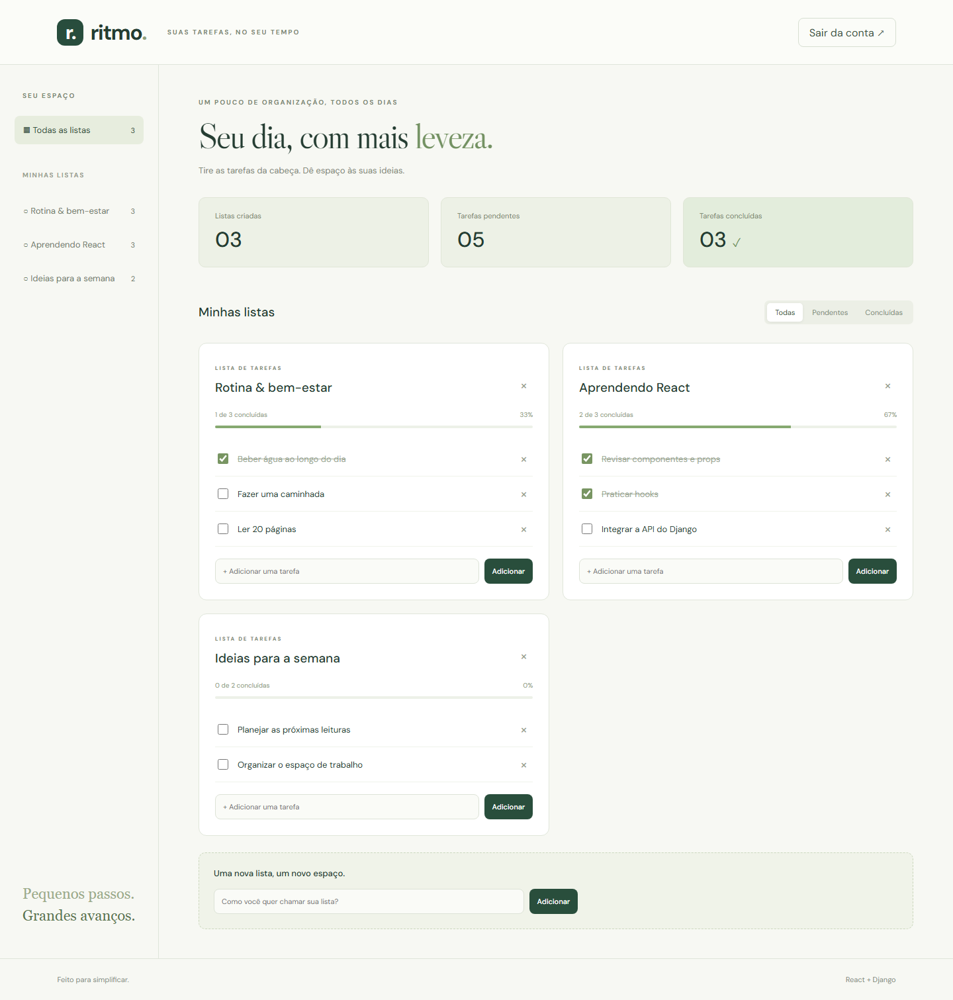
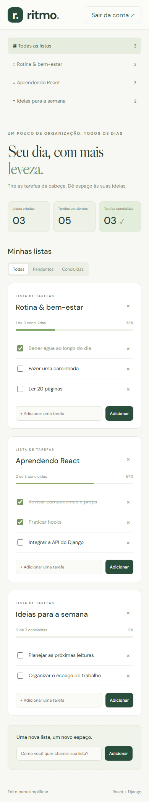

# Ritmo · React + Django

Aplicação de listas de tarefas baseada no curso de React e Django. Crie listas, organize tarefas e acompanhe seu progresso em uma interface responsiva em português.

## Capturas

Capturas da aplicação local conectada à API real, com dados de demonstração.

### Login



### Painel



### Celular



## Funcionalidades

- Login e logout, com sessão mantida na aba do navegador.
- Criação e exclusão de listas e tarefas.
- Conclusão de tarefas, filtros e indicadores de progresso.
- Estados de carregamento, erro e lista vazia.
- Isolamento dos dados por usuário, inclusive em alterações e exclusões.

## Tecnologias

React 19, Vite 7, Django 5.2 LTS, Django REST Framework e SQLite. Testes com Django e Playwright; formatação com Prettier.

Requisitos: **Node.js 22.12+**, npm e **Python 3.10+**. Validado com Node.js 22 e Python 3.13.

## Executar

Os comandos usam PowerShell e partem da raiz do repositório.

### Backend

```powershell
python -m venv .venv
.\.venv\Scripts\python -m pip install -r projeto/backend/requirements.txt
Copy-Item projeto/backend/.env.example projeto/backend/.env
.\.venv\Scripts\python projeto/backend/manage.py migrate
.\.venv\Scripts\python projeto/backend/manage.py createsuperuser
.\.venv\Scripts\python projeto/backend/manage.py runserver 127.0.0.1:8000
```

Entre na aplicação com o usuário criado. O Django Admin está em `http://127.0.0.1:8000/admin/`. No Linux/macOS, use `.venv/bin/python` e `cp` nos comandos equivalentes.

### Frontend

Em outro terminal:

```powershell
cd projeto/frontend
npm ci
Copy-Item .env.example .env
npm run dev
```

Acesse **http://127.0.0.1:5173**. Configure `VITE_API_URL` no `.env` para usar outra API e reinicie o Vite.

### Dados de demonstração

Opcionalmente, na raiz:

```powershell
$env:DEMO_PASSWORD = 'escolha-uma-senha-local'
.\.venv\Scripts\python projeto/backend/manage.py seed_demo
```

Entre com `demo` e a senha escolhida. O comando não duplica os exemplos e preserva a senha de um usuário demo existente. O banco local é ignorado pelo Git.

## Arquitetura

```text
docs/screenshots/               Capturas da aplicação
projeto/
  frontend/
    src/
      app/                     Composição da aplicação e estilos
      features/
        auth/                  Formulário e API de autenticação
        tasks/                 Painel e operações de tarefas
      shared/api/              Cliente HTTP e tratamento de erros
    tests/                     Testes no navegador
    scripts/capture.mjs         Reprodução das capturas
  backend/
    backend/                   Configuração e rotas globais
    core/
      models.py                Entidades persistidas
      selectors.py             Consultas limitadas ao usuário
      serializers.py           Validação e representação da API
      views.py                 Orquestração dos endpoints
      urls.py                  Rotas de tarefas
      migrations/              Histórico de esquema preservado
      management/commands/     Dados de demonstração
      tests.py                 Testes da API e autorização
```

O frontend separa apresentação e integração HTTP por funcionalidade. O backend separa consultas, validação e endpoints, usando o ORM do Django. A arquitetura é pragmática: não adiciona repositórios ou serviços sem necessidade, nem pretende implementar todas as camadas da Clean Architecture.

## API

Use `Authorization: Token <token>` nos endpoints protegidos.

| Endpoint | Métodos | Finalidade |
| --- | --- | --- |
| `/api-token-auth/` | POST | Login com `username` e `password` |
| `/list/` | GET, POST | Consultar e criar listas |
| `/list/{id}/` | GET, PUT, PATCH, DELETE | Consultar, editar e excluir lista |
| `/item/` | GET, POST | Consultar e criar tarefas com `list` e `name` |
| `/item/{id}/` | GET, PUT, PATCH, DELETE | Consultar, editar, concluir e excluir tarefa |

O servidor atribui o dono da lista. Tarefas só podem pertencer a listas do usuário autenticado. Recursos de outros usuários retornam 404. Nomes têm limite de 50 caracteres.

## Validação

Na raiz:

```powershell
.\.venv\Scripts\python projeto/backend/manage.py test core
.\.venv\Scripts\python projeto/backend/manage.py check
.\.venv\Scripts\python projeto/backend/manage.py makemigrations --check --dry-run
```

No frontend:

```powershell
npx playwright install chromium
npm test
npm run format:check
npm run build
npm run preview
```

Os testes da API verificam autenticação, isolamento entre usuários e ciclo de vida das tarefas. Os testes do navegador usam respostas controladas para verificar login, criação, conclusão, filtros, exclusão, logout e erro de autenticação. As capturas usam a API real.
